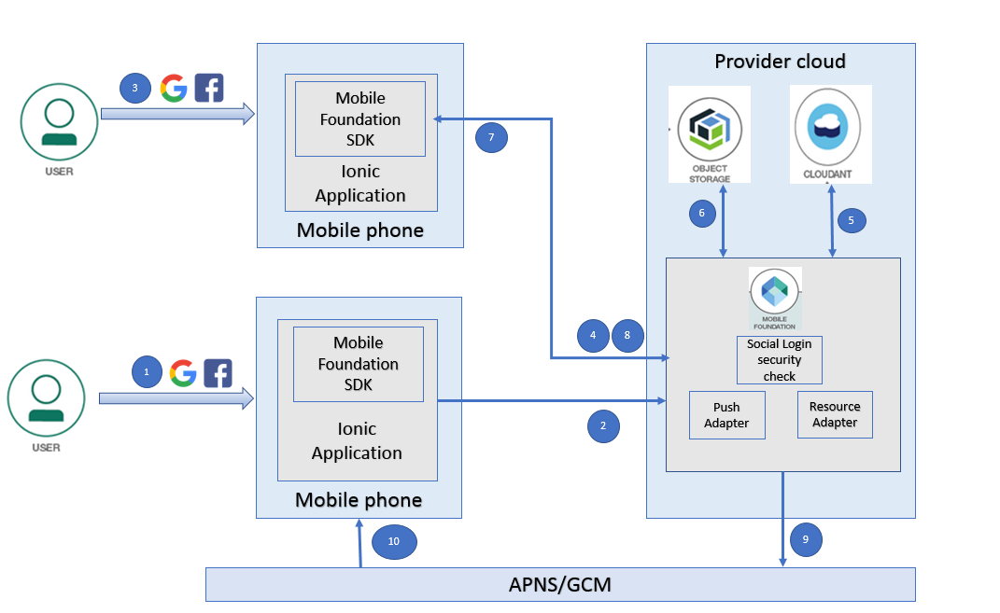
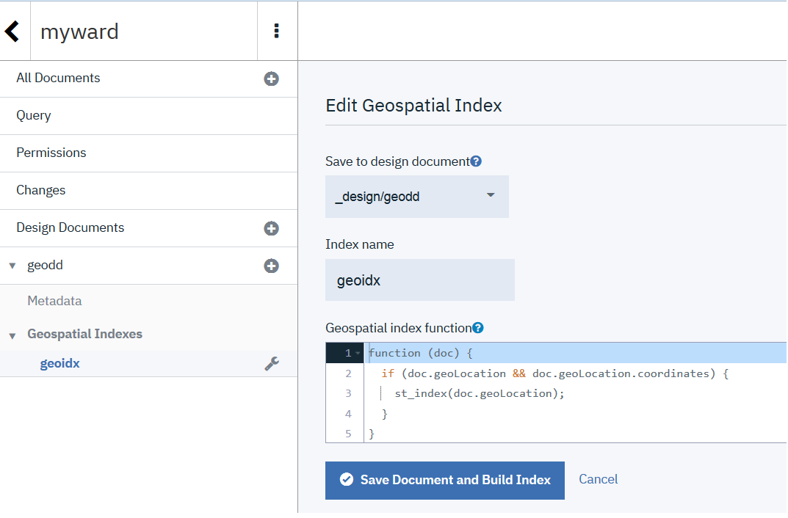
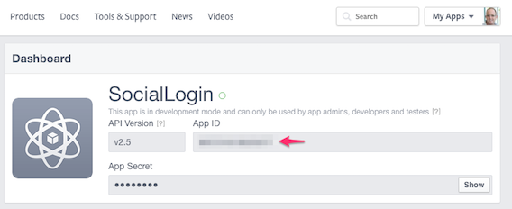
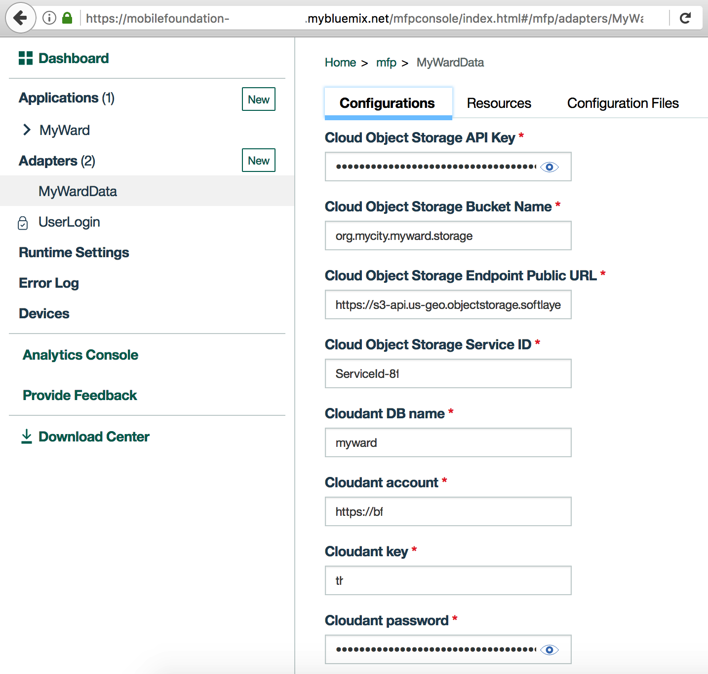
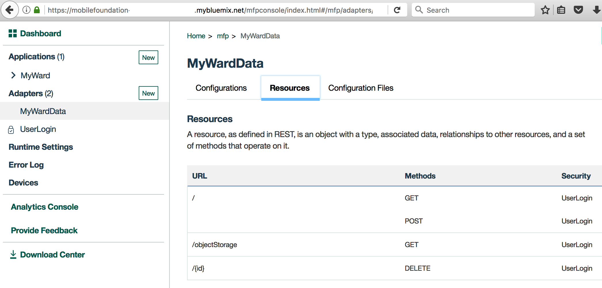
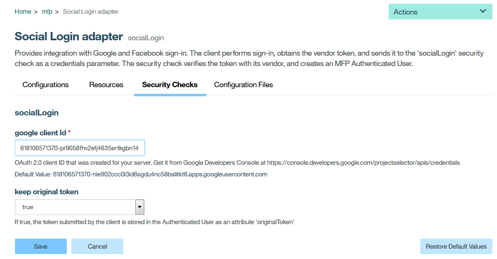
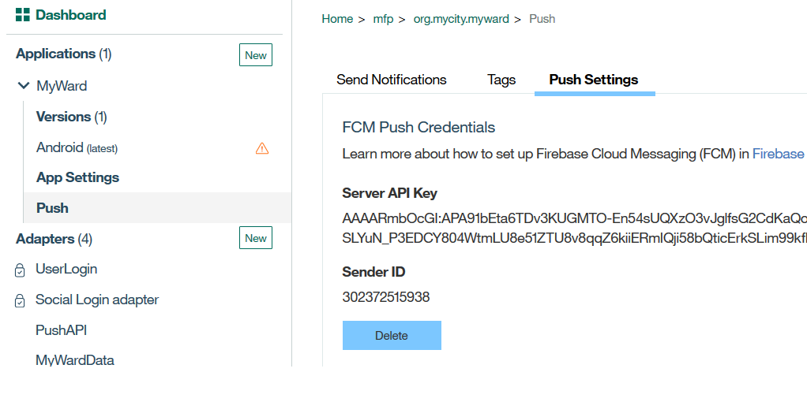
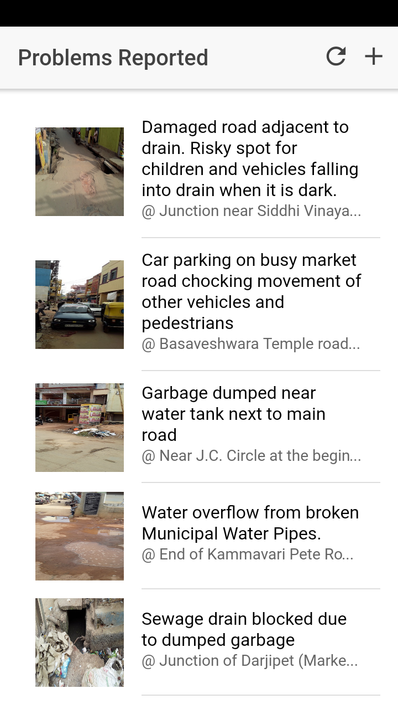
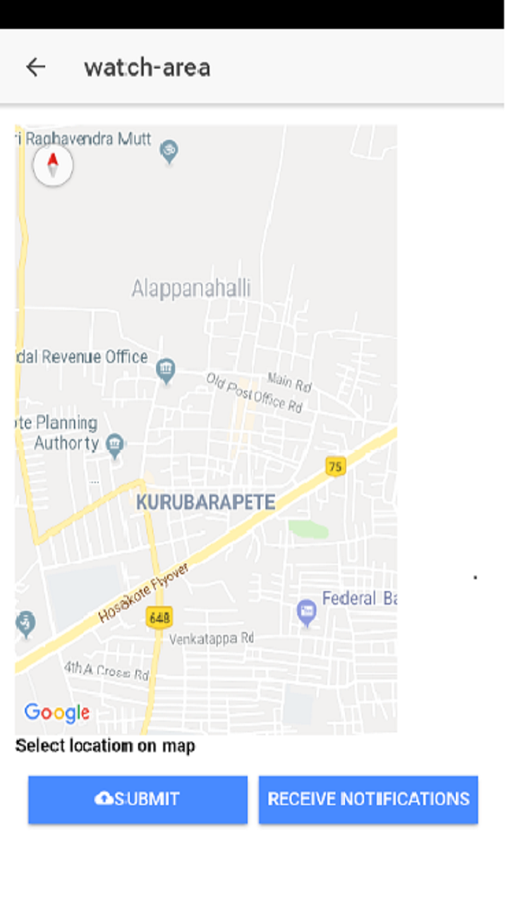
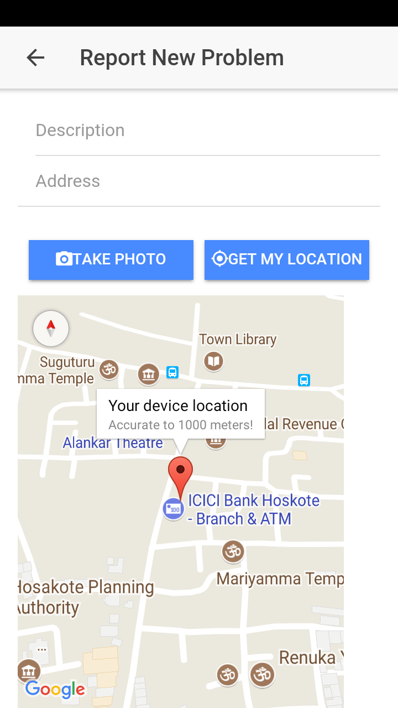

# Tag based push notifications using IBM Mobile Foundation

Push notifications have become integral part of mobile applications. For companies to advertise their latest offerings, or for banks or any of the financial institutions to alert customers on transactions, or to notify customers on any important announcements push notifications come in handy. Real time information like weather updates or travel related updates are very useful. If the customer installed a mobile application and subscribed to notifications, then it is the quickest and easiest way for businesses to convey a message to end user and request them to take action if needed.


IBM Mobile Foundation provides a unified set of API methods to send either push or SMS notifications to mobile applications. The unified notification mechanism makes the entire process of communicating with the users and devices completely transparent to the developer.

In this code pattern, we are going to use the base code pattern - https://github.com/IBM/Ionic-MFP-App - and add push notification feature to it. The use case is as below


•	Users can select an area in google map and subscribe to receive notifications on problems reported in that area

•	When any user submits a problem in that area, a notification is sent to all the users who have subscribed for the same.


When you have completed this code pattern, you will understand:


•	How to achieve tag-based push notification using IBM Mobile Foundation

•	How to create push notification tags on Mobile Foundation server using REST API 

•	How to send notifications using Mobile Foundation REST APIs.

•       How to utilise Cloudant geospatial index queries to find a set of locations within a given radius of user location.


## Flow

 


1.	User1 launches the mobile app, enters his/her credentials on the login screen or chooses social login to sign-in to the app. On successful login, the home page shows the grievances reported within a radius of 1000m of user's current location. User1 clicks open the 'Watch Area' page and selects a location in the map and clicks on ‘Receive notifications’. This invokes the push notification subscription API with the tag name same as the area name chosen by the user.
2.	The tag-based subscription request reaches the server. If the tag does not already exist, it is created on the server and then the application subscription for that tag is successfully completed
3.	User2 launches the mobile app, enters his/her credentials on the login screen or chooses social login to sign-in to the app. 
4.	In the home page, user clicks on + button to report a new civic problem. A new page is shown where user can enter a description for the new civic problem as well as capture image and geo-location of the problem spot. User clicks on Submit button. This action invokes the resource adapter. 
5.	Mobile app uploads the textual data to Cloudant NoSQL DB via resource adapter.
6.	Mobile app creates a thumbnail image by resizing the captured image and uploads both the captured image and thumbnail to Cloud Object Storage.
7.	Back on the home page the updated list of problem reports are shown.
8.	When the new issue is submitted by User2, a call to Push Adapter is made, to send a notification to all the users who subscribed for receiving notification on the issues reported for that area.
9.	Push Adapter sends the notification to APNS/GCM
10.	APNS/GCM sends the notification to all the tag based notification subscribers (in this case User1).
Included Component


## Included Components
* [Cloudant NoSQL DB](https://console.ng.bluemix.net/catalog/services/cloudant-nosql-db): A fully managed data layer designed for modern web and mobile applications that leverages a flexible JSON schema.
* [Cloud Object Storage](https://console.bluemix.net/catalog/infrastructure/cloud-object-storage): A highly scalable cloud storage service, designed for high durability, resiliency and security.
* [Mobile Foundation](https://console.bluemix.net/catalog/services/mobile-foundation): A scalable mobile access gateway powered by the market-leading IBM Mobile Foundation Technology. The service offers a comprehensive set of mobile backend capabilities such as, App life cycle, Push, Analytics, Feature Toggle, Security and Authentication and offline synch.


## Featured Technologies
* [Mobile](https://mobilefirstplatform.ibmcloud.com/): Systems of engagement are increasingly using mobile technology as the platform for delivery.

# Watch the Video
https://youtu.be/g5WYpchw7-Q

# Steps

* [1. Setup Ionic and MFP CLI](https://github.com/IBM/Ionic-MFP-App#step-1-setup-ionic-and-mfp-cli)
* [2. Create Cloudant database and populate it with sample data](https://github.com/IBM/Ionic-MFP-App#step-2-create-cloudant-database-and-populate-it-with-sample-data)
* [3. Create IBM Cloud Object Storage service and populate it with sample data](https://github.com/IBM/Ionic-MFP-App#step-3-create-ibm-cloud-object-storage-service-and-populate-it-with-sample-data)
* [4. Create Mobile Foundation service and configure MFP CLI](https://github.com/IBM/Ionic-MFP-App#step-4-create-mobile-foundation-service-and-configure-mfp-cli)
* [5. Create Geospatial Index in Cloudant Database ](#51-create-geospatial-index-in-cloudant-database)
* [6. Setup FCM for android push notifications ](#step-6-setup-fcm-for-android-push-notifications)
* [7. Register Android App with Google and Facebook for Social Login ](#step-7-register-android-app-with-google-and-facebook-for-social-login)
* [8. Download source repo and customize](#step-8-download-source-repo-and-customize)
  - [8.1 Clone repo](#81-clone-repo)
  - [8.2 Update App ID, Name and Description](#82-update-app-id-name-and-description)
  - [8.3 Specify Cloudant credentials in MobileFoundation adapter](#83-specify-cloudant-credentials-in-mobilefoundation-adapter)
  - [8.4 Specify Cloud Object Storage credentials in MobileFoundation Adapter](#84-specify-cloud-object-storage-credentials-in-mobilefoundation-adapter)  
  - [8.5 Specify Google Sign-in credentials in MobileFoundation Adapter](#85-specify-google-sign-in-credentials-in-mobilefoundation-adapter)
  - [8.6 Specify the Facebook AppID and Google clientID in the Ionic App](#86-specify-the-facebook-appid-and-google-clientid-in-the-ionic-app)
* [9. Deploy the MobileFoundation Adapters](#step-9-deploy-the-mobilefoundation-adapters)
  - [9.1 Build and Deploy the MobileFoundation adapters](#91-build-and-deploy-the-mobilefoundation-adapters)
  - [9.2 Launch MobileFoundation dashboard and verify adapter configurations](#92-launch-mobilefoundation-dashboard-and-verify-adapter-configurations)
  
* [10. Run application on Android phone](https://github.com/IBM/Ionic-MFP-App#step-7-run-application-on-android-phone)


## Prerequisite steps
This project builds on top of https://github.com/IBM/Ionic-MFP-App. Run following steps from that [base project](https://github.com/IBM/Ionic-MFP-App) to provision the needed mobile backend services from IBM Cloud and populate them with sample data, as well as to setup Ionic and MFP CLI on your development machine.

 * [Step 1. Setup Ionic and MFP CLI](https://github.com/IBM/Ionic-MFP-App#step-1-setup-ionic-and-mfp-cli) 
 * [Step 2. Create Cloudant database and populate it with sample data](https://github.com/IBM/Ionic-MFP-App#step-2-create-cloudant-database-and-populate-it-with-sample-data)
 * [Step 3. Create IBM Cloud Object Storage service and populate it with sample data](https://github.com/IBM/Ionic-MFP-App#step-3-create-ibm-cloud-object-storage-service-and-populate-it-with-sample-data)
 * [Step 4. Create Mobile Foundation service and configure MFP CLI](https://github.com/IBM/Ionic-MFP-App#step-4-create-mobile-foundation-service-and-configure-mfp-cli)


## Step 5. Further setup for Cloudant database.

### 5.1 Create Geospatial Index in Cloudant database.

Launch the cloudant database (created in step 2 above) console, and create the following design document 'geodd' with index name 'geoidx'

"function(doc) {
if (doc.geoLocation && doc.geoLocation.coordinates) 
{st_index(doc.geoLocation);}
}"  





Given location co-ordinates (latitude,longitude), this index helps to query the grievances reported within a given radius with centre as this co-ordinate.

### 5.2 Loading data into Cloudant database
Step 2 in this readme has instructions to load data into the Cloudant database. Sample data has been provided. This sample data is for location 'Hoskote' near Bangalore, India. The 'MyWard' application loads the home page with the issues that are reported in the area of the current user location. So to test the application, please load few entries of data (in the same format as the Sample data)  that belongs to the location where the test device is located. These entries will show up in the home page on login. If there are no matching entries available in the database, then a message will pop up that "No issues reported in your current location". You can also add new entries for your current location through the 'MyWard' application 'Report New' page.


## Step 6. Setup FCM for android push notifications

Obtain your notification provider credentials, create a FCM project and add the same to your Android application. Include the package name of your application as com.ibm.mobilefirstplatform.clientsdk.android.push. Refer the documentation [here](https://console.bluemix.net/docs/services/mobilepush/push_step_1.html#push_step_1_android) , until the step where you have finished generating the google-services.json file. Note down the sender ID, ServerKey and save the google-services.json file. These details will be used in step 10.


## Step 7. Register Android App with Google and Facebook for Social Login


1. Get the Google Web Client ID by registering the app at [Google API console](https://console.developers.google.com/apis/credentials)


2. Get the Facebook App ID by registering the app at [Facebook apps console](https://developers.facebook.com/apps/)




## Step 8. Download source repo and customize

### 8.1 Clone repo

```
$ git clone https://github.com/IBM/tag-based-push-notifications.git
$ cd tag-based-push-notifications
```

### 8.2 Update App ID, Name and Description

Update `IonicMobileApp/config.xml` as below. Change `id`, `name`, `description` and `author` details appropriately.

<pre><code>
&lt;?xml version='1.0' encoding='utf-8'?&gt;
&lt;widget <b>id="org.mycity.myward"</b> version="2.0.0" xmlns="http://www.w3.org/ns/widgets" xmlns:cdv="http://cordova.apache.org/ns/1.0" xmlns:mfp="http://www.ibm.com/mobilefirst/cordova-plugin-mfp"&gt;
    <b>&lt;name&gt;MyWard&lt;/name&gt;
    &lt;description&gt;Get your civic issues resolved by posting through this app.&lt;/description&gt;
    &lt;author email="devipriya@test.com" href="https://developer.ibm.com/code/author/dselvara"&gt;Devipriya&lt;/author&gt;</b>
...
</code></pre>

### 8.3 Specify Cloudant credentials in MobileFoundation adapter

Open `MobileFoundationAdapters/MyWardData/src/main/adapter-resources/adapter.xml` and update the following properties to point to the Cloudant database created in [Step 2](#step-2-create-cloudant-database-and-populate-it-with-sample-data).
 * Update `key` and `password` with the Cloudant API key as generated in [Step 2.2](#22-generate-cloudant-api-key).
 * For property `account`, specify the Cloudant Dashboard URL portion upto (and including) *-bluemix*.
 * For property `DBName`, leave the default value of `myward` as-is.

<pre><code>
&lt;mfp:adapter name="MyWardData" ...&gt;
  <b>&lt;property name="account" displayName="Cloudant account" defaultValue=""/&gt;
  &lt;property name="key" displayName="Cloudant key" defaultValue=""/&gt;
  &lt;property name="password" displayName="Cloudant password" defaultValue=""/&gt;
  &lt;property name="DBName" displayName="Cloudant DB name" defaultValue="myward"/&gt;</b>
  ...
&lt;/mfp:adapter&gt;
</code></pre>


### 8.4 Specify Cloud Object Storage credentials in MobileFoundation Adapter

Open `MobileFoundationAdapters/MyWardData/src/main/adapter-resources/adapter.xml` and update the following properties to point to the Cloud Object Storage created in [Step 3](#step-3-create-ibm-cloud-object-storage-service-and-populate-it-with-sample-data).
  * Specify value for `bucketName` as created in [Step 3.1](#31-create-ibm-cloud-object-storage). 
  * Specify `serviceId` and `apiKey` created in [Step 3.2](#32-create-service-id-and-api-key-for-accessing-objects).
  * While creating the bucket in [Step 3.1](#31-create-ibm-cloud-object-storage), if you selected a different Location/Resiliency, then update the `endpointURL` as per the specification in https://console.bluemix.net/docs/services/cloud-object-storage/basics/endpoints.html#select-regions-and-endpoints.

<pre><code>
&lt;mfp:adapter name="MyWardData" ...&gt;
  ...
  <b>&lt;property name="endpointURL" displayName="Cloud Object Storage Endpoint Public URL" defaultValue="https://s3-api.us-geo.objectstorage.softlayer.net"/&gt;
  &lt;property name="bucketName" displayName="Cloud Object Storage Bucket Name" defaultValue=""/&gt;
  &lt;property name="serviceId" displayName="Cloud Object Storage Service ID" defaultValue=""  /&gt;
  &lt;property name="apiKey" displayName="Cloud Object Storage API Key" defaultValue=""/&gt;</b>
&lt;/mfp:adapter&gt;
</code></pre>


### 8.5 Specify Google Sign-in credentials in MobileFoundation Adapter
Open `MobileFoundationAdapters/SocialLoginAdapter/src/main/adapter-resources/adapter.xml ' and update the google client-id created in [step 7](#step-7-register-android-app-with-google-and-facebook-for-social-login) as shown below

<pre><code>
&lt;property name="google.clientId"
                  defaultValue="01234567890-01234567890987654abcde.apps.googleusercontent.com"
				  displayName="google client Id"
                  description="OAuth 2.0 client ID that was created for your server. Get it from Google Developers Console
                  at https://console.developers.google.com/projectselector/apis/credentials"/&gt;

</code></pre>

### 8.6 Specify the Facebook AppID and Google clientID in the Ionic App

1. Install the Cordova and Ionic Facebook plugin using following commands (Python2 is a pre-requisite)

	$ cd IonicMobileApp/

	$ ionic cordova plugin add cordova-plugin-facebook4 --variable APP_ID="your_appid_from_step7" --variable APP_NAME="your application name"

	$ npm install --save @ionic-native/facebook

	Note: If you get a message "Looks like a fresh checkout!" please go ahead and type Yes to install the project dependencies. This might take a few minutes. 


2. Install the Cordova and Ionic GooglePlus plugin using following commands

	$ ionic cordova plugin add cordova-plugin-googleplus --variable REVERSED_CLIENT_ID="reverseclientid_from_step7"

	$ npm install --save @ionic-native/google-plus

	Note : The ```REVERSED_CLIENT_ID``` is the reverse form of the google webclientID obtained in step7.
For example, if the webClientID is '0123456789-pr0123fhv2efj4635ertkgbn14tda2ha.apps.googleusercontent.com', then the REVERESED_CLIENT_ID will be 'com.googleusercontent.apps.0123456789-pr0123fhv2efj4635ertkgbn14tda2ha'


3. After the facebook and googleplus plugins are installed, check if the Facebook App ID and Google webclientID obtained in [step 7](#7-register-android-app-with-google-and-facebook-for-social-login) are present in the config.xml file as shown below

	```
	<plugin name="cordova-plugin-facebook4" spec="^1.9.1">
        <variable name="APP_ID" value="your_appid" />
        <variable name="APP_NAME" value="MyWard" />
    </plugin>
	```
	```
	<plugin name="cordova-plugin-googleplus" spec="^5.3.0">
        <variable name="REVERSED_CLIENT_ID" value="your_reverse_clientid" />
    </plugin>
	```

4. Also add the webclientID in the auth_handler.ts file in the googlePlusLogin() method.


## Step 9. Deploy the MobileFoundation Adapters

### 9.1 Build and Deploy the MobileFoundation adapters

Build and deploy `MyWardData` Adapter as below.

```
$ cd MobileFoundationAdapters/
$ cd MyWardData
$ mfpdev adapter build
$ mfpdev adapter deploy 
```

Note- If the server is not a default one, please mention the server name 'mfpdev adapter deploy command' in the command.


Build and deploy `UserLogin` adapter as below.
```

$ cd ../UserLogin/
$ mfpdev adapter build
$ mfpdev adapter deploy
```

Build and deploy `SocialLoginAdapter` adapter as below.

```
$ cd ../SocialLoginAdapter/
$ mfpdev adapter build
$ mfpdev adapter deploy
```
Build and deploy `PushAPI` adapter as below.

```
$ cd ../PushAPI/
$ mfpdev adapter build
$ mfpdev adapter deploy
```

### 9.2 Launch MobileFoundation dashboard and verify adapter configurations

Launch MFP Dashboard as below:
  * In the [IBM Cloud dashboard](https://console.bluemix.net/dashboard/), under `Cloud Foundry Services`, click on the `Mobile Foundation` service you created in [Step 4](https://github.com/IBM/Ionic-MFP-App#step-4-create-mobile-foundation-service-and-configure-mfp-cli). The service overview page that gets shown, will have the MFP dashboard embedded within it. You can also open the MFP dashboard in a separate browser tab by appending `/mfpconsole` to the *url* mentioned in [Step 4](https://github.com/IBM/Ionic-MFP-App#step-4-create-mobile-foundation-service-and-configure-mfp-cli).
  * Inside the MFP dashboard, in the list on the left, you will see the `UserLogin`, `SocialLoginSecurityCheck`, `PushAPI` and `MyWardData` adapters listed.

Verify MFP Adapter configuration as below:

  1. Inside the MobileFoundation dashboard, click on the `MyWardData` adapter. Under `Configurations` tab, you should see the various properties we specified in [Step 8.3](#83-specify-cloudant-credentials-in-mfp-adapter) and [Step 8.4](#84-specify-cloud-object-storage-credentials-in-mfp-adapter) for accessing Cloudant database and Cloud Object Storage as shown below. As an alternative to specifying those property values in `MobileFoundationAdapters/MyWardData/src/main/adapter-resources/adapter.xml` as previously shown in [Step 8.3](#83-specify-cloudant-credentials-in-mfp-adapter) and [Step 8.4](#84-specify-cloud-object-storage-credentials-in-mfp-adapter), you can deploy the adapters with empty `defaultValue`, and once the adapter is deployed, change the values on this page.

  

  * Click on `Resources` tab. You should see the various REST APIs exposed by `MyWardData` adapter as shown below. The `Security` column should show the protecting scope `UserLogin` against each REST method.
    
  

2.	Click open the 'SocialLoginSecurityCheck' to check its configuration.
 	


## Step 10. Run application on Android phone

1. Follow the instructions in step 7.1 to 7.5 from [step7](https://github.com/IBM/Ionic-MFP-App#step-7-run-application-on-android-phone) of base project to run the application on Android phone. 

2. Open the Mobile foundation server dashboard and add the FCM server key and sender id generated in step 6 of this document.



3. In the Runtime settings of the application please create a confidential client with name 'test', secret 'test' and scope '**'.
If different confidential client is used, then please modify the PushAPI adapter code to use the right confidential client encoded name and secret.

4. Add the google-service.json file generated in step 6 to the root of the android project directory. 

5. Open the Project in android studio, build and run the app either using emulator or device. Please refer to the Troubleshooting section for more information on build related issues. 

6. To test the Push notification feature, in one instance of the application, subscribe to receive notifications for a particular area in the 'Watch Area' page. In another instance of the application (running on a different phone) create a new grievance for the same area. The notification of the newly created grievance will be seen on the first instance of the application. 
If you are using emulator to test, please setup the co-ordinates of the emulator to point to your current location.


    


# Troubleshooting

Please see instructions for [debugging Android hybrid app using Chrome Developer Tools](https://github.com/IBM/Ionic-MFP-App#debugging-android-hybrid-app-using-chrome-developer-tools) or [troubleshooting guide](https://github.com/IBM/MFP-Push/blob/master/TROUBLESHOOTING.md) for solutions to some commonly occurring problems.

# References


*	[Implementing Social Login Authentication with IBM MobileFirst Platform Foundation 8.0](https://mobilefirstplatform.ibmcloud.com/blog/2016/04/06/social-login-with-ibm-mobilefirst-platform-foundation/)
*	[Authentication and Security](https://mobilefirstplatform.ibmcloud.com/tutorials/en/foundation/8.0/authentication-and-security/)
*	[Facebook Login](https://developers.facebook.com/docs/facebook-login)
*	[Google SignIn](https://developers.google.com/identity/)
*	[FCM setup](https://mobilefirstplatform.ibmcloud.com/tutorials/ru/foundation/8.0/notifications/handling-push-notifications/android/#fcm-project-setup)

# License
[Apache 2.0](LICENSE)
